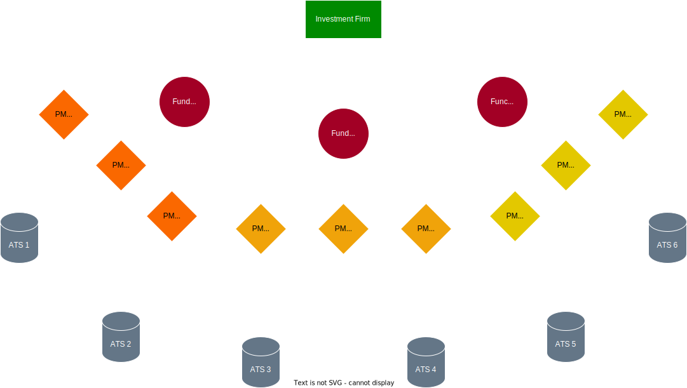

# Inkosi

## Table of Contents

- [Introduction](#introduction)
- [Installation](#installation)
    - [On Windows](#installation-on-windows)
    - [On Windows-based Docker Container](#installation-as-a-windows-based-docker-container)
- [Future Versions](#future-versions)

## Introduction

> [!NOTE]
> Currently working on the 'develop' branch

> [!IMPORTANT]
> At the state of art, due to the MetaTrader5 API, Windows is the only operating system supporting the platform

It is a __OMS__ *(Order Management System)* written in Python which interacts, through the MetaTrader5 library, with the MetaTrader5 Client.
The project aims to offers a solid and reliable infrastructure able to quickly open and close trading positions.

## Installation

As already mentioned, due to the MetaTrader5 API (which currently represents the only API Available for __*Trading Execution*__).
MetaTrader5 is the most used trading platform on CFDs Broker.

> [!NOTE]
> __*CFD*__, *Credit For Difference*, is a contract between a buyer and a seller that stipulates that the buyer must pay the seller the difference between the current value of an asset and its value at contract time.

### Installation on Windows

### Installation as a Windows-based Docker Container

In the repository, a __compose.yaml__ file is available to run all the services necessary to let platform properly work.

## Future Versions

- New API Supporting will be provided, in particular: __*TWS API*__ (Trader Workstation API)
- Introduce __Linux__ support for
    - __Machine__ Instance
    - __Docker__ Instance