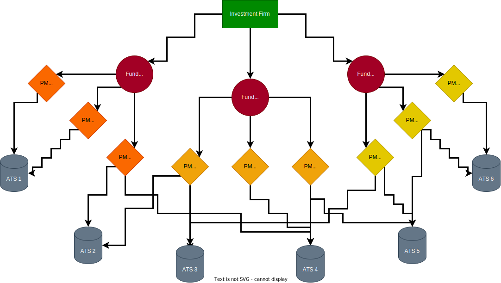

## __Introduction__

### _Terminology_

The term __Inkosi__ could sounds a little bit _weird_, indeed, it is actually coming from the _Zulu_ vocabulary, and it means __King__ or __Chief__ in _English_.

### _Inspiration_
The choice was inspiered by [Kubernetes](https://kubernetes.io/), a _container orchestration system_ (It does completely different things).
  
I just wanted to create a platform based on __multiservices__ in order to _simplify_, _accelerate_ and _streamline_ the Financial Institution __daily activies__.

### _Definition_
The _project_ aims to offer an __Algorithmic Trading Platform__, the idea is not meant to develop a trading strategy but, to build a _reliable_, _efficient_ and _maintainable_ __solution__ to __open__ and __close__ positions accordingly to algorithmic or manual trading signals, __backtest__ your algorithmic trading strategies, __manage__ commissions for all you investors, __infer__ on the markets, __manage__ risk efficiently, ...
 
 
As shown below, the __platform__ has been _structured_ to serve __financial institution__ which generally follow the presented __pattern__:

- __Investment Firm__
    - A financial institution that __manages__ and __invests__ money _on behalf of_ individuals or organisations, with the __objective__ of _generating financial returns_.
- __Funds__
    - All the money __collected__ through an _initial campaign_ of the Investment Firm are distributed and assigned to __different funds__ according to __different features__ such as:
        - __Liquidity__
        - __Asset__
        - __Investment Objectives__
        - ...
- __Portfolio Manager__ (Numerous and various assigned to different funds)
    - He is a _financial professional_ or an _entity responsible_ for managing an investment portfolio on behalf of __funds__
    - For each __funds__ are generally assigned a __different number of portfolio managers__ in accordance with their _prior_ experiences, _financial_ knowledge, etc.
- __ATS__ (Algorithmic Trading Strategies)
    - A simple application able to send __trading signals__ to the main platform accordingly to strategies based on an __empirical approach__, __machine learning models__, etc.

### _Definition_

It is a __OMS__ (Order Management System) written in _Python_ which interacts, through the __MetaTrader 5__ library, with the MetaTrader 5 Client. 
 
The project aims to offers a __solid__ and __reliable__ _infrastructure_ able to quickly __open__ and __close__ trading positions.

## __Libraries__

Here you will find the list with all the libraries implemented on the platform with its explanation:

- [SQLAlchemy](https://docs.sqlalchemy.org/en/20/) - Version (2.0.21)
    - It has been used for __interactions__ with the _PostgreSQL database_ (going forward with the documentation, it is possible to analyze these aspects more thoroughly) 
- [Beartype](https://beartype.readthedocs.io/en/latest/) - Version 0.16.2
    - Beartype is an open-source pure-Python runtime type checker emphasizing efficiency, portability, and thrilling puns.
    - Used to __check if__ some methods parameters have been correctly typed
- [FastAPI](https://fastapi.tiangolo.com/) - Version 0.103.2
    - FastAPI is a modern, fast (high-performance), __web framework__ for building __APIs__ with Python 3.7+ based on standard Python type hints.
    - All the __endpoints__, both for Investors and Administrators, have been developed and organised through FastAPI
- [NumPy](https://numpy.org/doc/stable/) - Version 1.26.0
    - NumPy is the __fundamental package__ for scientific computing in Python.
    - Most of the operation on __backtesting__ are performed through __NumPy__ (God saves Cython)
- [OmegaConf](https://omegaconf.readthedocs.io/en/2.3_branch/) - Version 2.3.0
    - OmegaConf is a __YAML__ based _hierarchical configuration system_, with support for merging configurations from multiple sources providing a consistent API regardless of how the configuration was created.
    - All the settings are loaded through this library
- [Pandas](https://pandas.pydata.org/) - Version 2.1.2
    - Pandas is a fast, powerful, flexible and easy to use open source _data analysis_ and _manipulation_ __tool__, built on top of the Python programming language.
    - Used to work with __Financial Data Frames__
- [Pandas TA](https://github.com/twopirllc/pandas-ta) - Version 0.3.14b0
    - Pandas Technical Analysis (Pandas TA) is an easy to use library that leverages the Pandas package with more than __130 Indicators__ and __Utility functions__ and more than 60 TA Lib Candlestick Patterns.
    - Used to compute __different technical indicators__ on prices in order to provide backtesting tools
- [Psycopg](https://www.psycopg.org/docs/)
    - Psycopg is the most popular __PostgreSQL database adapter__ for the Python programming language.
    - Auxiliar to SQLAlchemy
- [PyDantic](https://docs.pydantic.dev/latest/api/base_model/) - Version 2.4.2
    - Pydantic is the most widely used data validation library for Python.
    - Fast and extensible, Pydantic plays nicely with your linters/IDE/brain.
    - Written in __Rust__!
    - Used to __validate specific settings__ coming from .env file (Auxiliar to PyDantic Settings, another library used)
- [PyMongo](https://pymongo.readthedocs.io/en/stable/) - Version 4.5.0
    - PyMongo is a Python distribution containing tools for working with MongoDB, and is the recommended way to work with MongoDB from Python.
    - Used to __interact__ with the MongoDB Instance
    - Further information available in both the __Databases__ and __Code Analysis__ parts
- [Streamlit](https://streamlit.io/) - Version 1.28.0
    - Streamlit turns data scripts into shareable web apps in minutes. All in pure Python.
    - __Investor__ and __Administrators__ _Frontend experiences_ have been developed using this library
    - Backtesting Frontend experience has been developed using this Library
- [yfinance](https://pypi.org/project/yfinance/) - Version 0.2.31
    - yfinance offers a __threaded__ and __Pythonic__ _way_ to download market data from
    - All the _markets data_ are downloaded through this library
- [PyTorch](https://pytorch.org/docs/stable/index.html) - Version 2.1.0
    - PyTorch is a _machine learning framework_ based on the Torch library
    - Originally developed by Meta AI and now part of the Linux Foundation
    - Together with __TensorFlow__, the most important Machine Learning development framework
    - Used to load __pre-trained Risk Management Model__

## __Installation__

### _General Information_

At the state of art, the __platform__ could only interacts with markets on __Windows__, due to _MetaTrader API_.
 
 
__MetaTrader 5__ (MT5) is a _versatile_ trading platform offering advanced tools for forex and stock trading. It provides real-time market _analysis_, _automated trading_, and _customizable features_ for traders.
 
 
Currenty, it is a platform widely used by __different brokers__, and it is also free to use compared to __Trader Workstation__. In the future, I would really like to implement __TWS API__ (_Trader WorkStation API_ to render Inkosi __versatile__)
 
 
_I apologise for the_ __incovenience__.

### _Advanced Python Programming For Economics, Management And Finance Exam_

At the moment a __Compute Engine__ instance, a simple virtual machine running on __Microsoft Server 2022__, here are contained all the needed tools (expect from MetaTrader 5) to interact with the platform.
  

__Tools__:

- _Visual Studio Code_
    - Here the _latest version_ of the code has been loaded, you will be able to have a closer look to it
- _Postman_
    - Postman is an API platform for developers
    - All the __API Endpoints__ are available on this platform, divided by features
- _Mongo Compass_
    - __Compass__ is a _free interactive_ tool for _querying_, _optimizing_, and _analyzing_ MongoDB data
    - A connection has already been created
- _HeidiSQL_
    - HeidiSQL is a _free_ and _open-source_ administration tool for MariaDB, MySQL, as well as Microsoft SQL Server, PostgreSQL and SQLite
- _Google Chrome_
    - Most widely used internet browser
    - You will have access to _Frontend experiences_

All the information needed to use the _Virtual Machine_ have been inserted in the __README.txt__ file of the uploaded folder.
  
Two __databases__ have been created to _respectively_ interact to __PostgreSQL__ and __MongoDB__ (Access only available through the Virtual Machine, IP Address restriction has been implemented. Credentials avaiable in the _uploaded folder_ on __BlackBoard__)

## __Issues & Suggestions Tracker__

### _GitHub Issues_

For any issues, please refers to [GitHub Issues](https://github.com/BopaxDev/Inkosi/issues)

## __Support__

A star on the __GitHub__ _project_, if you liked it, would be more than __appreciated__.

## __Contact__

- [GitHub](https://github.com/BopaxDev)
- [LinkedIn](https://www.linkedin.com/in/mario-nicolo-de-matteis)
- [X](https://twitter.com/MDMatteis)
- [E-mail Address](mailto:marionicdematteis@gmail.com)